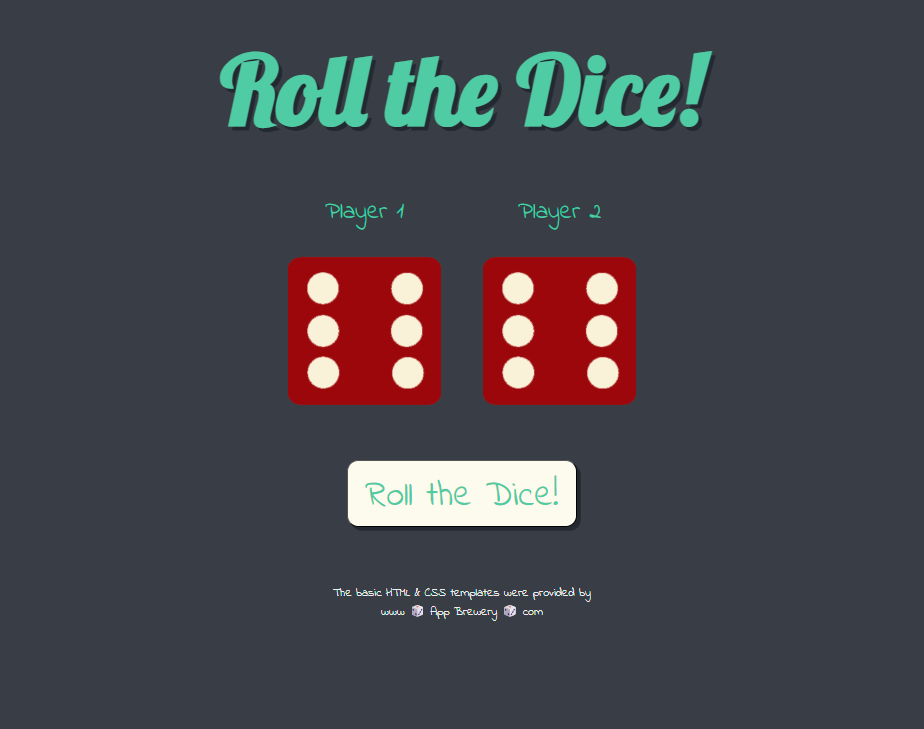
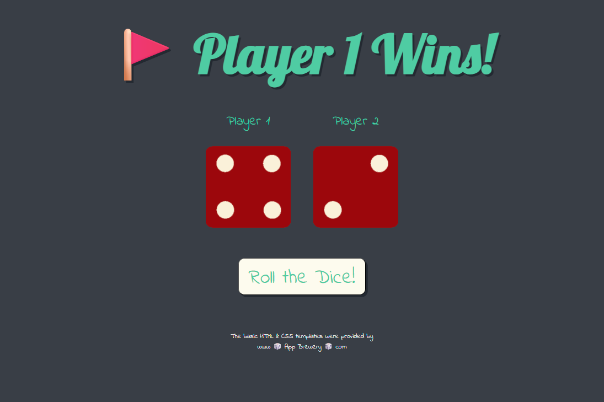
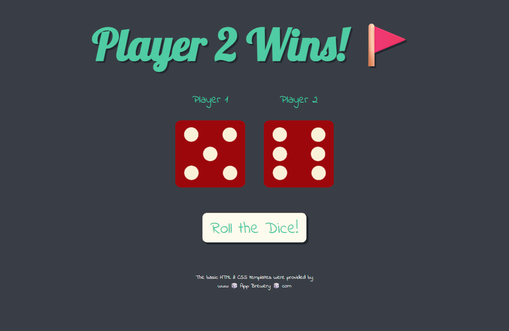
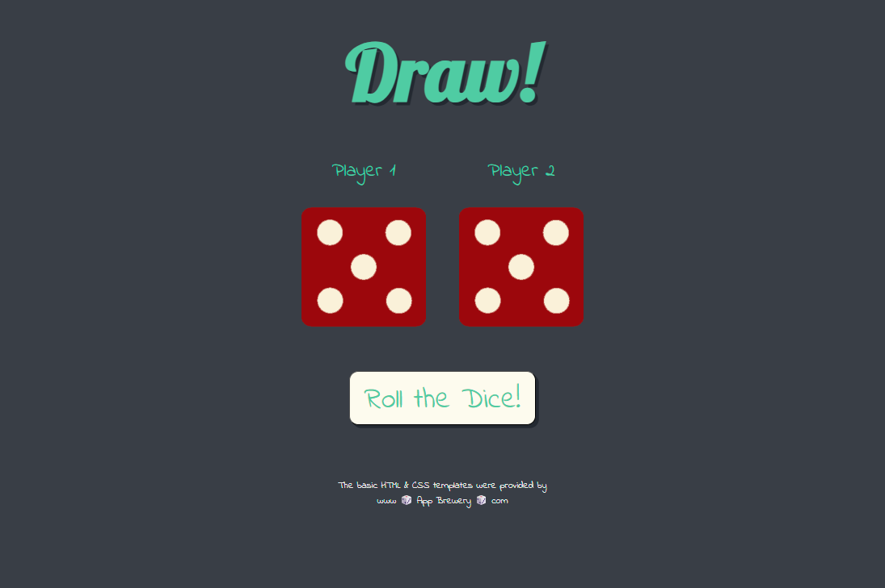

# Dice Game


>This simple dice game was a small project to consolidate the JavaScript skills I had learned so far in <em>Dr. Angela Yu's</em> Udemy course, <em>‘The Complete Full-Stack Web Development Bootcamp.’</em>
<br><br>
The HTML and CSS code was provided by <em>App Brewery</em> as part of the course and I only made minor adjustments. <br>
For example, I added the ‘Roll the Dice!’ button – the original layout was designed so that the game would be played using the browser's ‘reload page’ function.
<br><br>
For this reason, I will only focus on the JS part in the rest of this document.

><b>Live Demo on GitHub Pages: </b> <a href="https://david-voss.github.io/Dice-Game/" target="_blank" rel="noopener noreferrer" title="david-voss.github.io/Dice-Game/">Dice Game</a>

## Table of contents
1. &#128444;&#65039; Preview of the application
2. &#127760; Function Descriptions

## Preview of the application:
### **_Default game state:_**
<br><br>
---
### **_Player 1 has won:_**
<br><br>
---
### **_Player 2 has won:_**
<br><br>
---
### **_Draw:_**
<br><br>
---

## Function Descriptions

### randomNumber()
Generates a random integer between 1 and 6 (inclusive), simulating a standard dice roll.
```
function randomNumber() {
    return Math.floor(Math.random() * 6) + 1;
}
```
<br>

### imageSelector(number)
Returns the file path for the dice image corresponding to the provided number.
```
function imageSelector(number) {
    return `./images/dice${number}.png`;
}
```
<br>

### changeDiceImage(imgClass, die)
Updates the `src` attribute of an image element (given by the parameter `imgClass`) to display the corresponding dice face based on the `die` value.
```
function changeDiceImage(imgClass, die) {
    return document.querySelector(imgClass).setAttribute("src", imageSelector(die));
}
```
<br>

### winnerEvaluation(die1, die2)
Compares two dice values and returns a string declaring the winner or a draw. Includes Unicode flag emoji for visual emphasis.
```
function winnerEvaluation(die1, die2) {
    if (die1 === die2) {
        return "Draw!";
    } else if (die1 > die2) {
        return "&#128681; Player 1 Wins!";
    } else if (die1 < die2) {
        return "Player 2 Wins! &#128681;";
    }
}
```
<br>

### playGame()
Rolls two dice, updates the image elements, and sets the winner text in the `<h1>` element on the page.
```
function playGame() {
    let dieNumber1 = randomNumber();
    let dieNumber2 = randomNumber();

    changeDiceImage(".img1", dieNumber1);
    changeDiceImage(".img2", dieNumber2);

    document.querySelector("h1").innerHTML = winnerEvaluation(dieNumber1, dieNumber2);
}
```
<br>

### Initial Page Behaviour
Checks if the user has visited the page before (via `sessionStorage`).
<li> On first visit, sets a session flag but does not roll the dice.
<li> On subsequent visits, immediately runs playGame() to display the result.<br>

```
window.onload = function () {
    if (sessionStorage.getItem("visited")) {
        playGame();
    } else {
        content
        sessionStorage.setItem("visited", "true");
    }
};
```